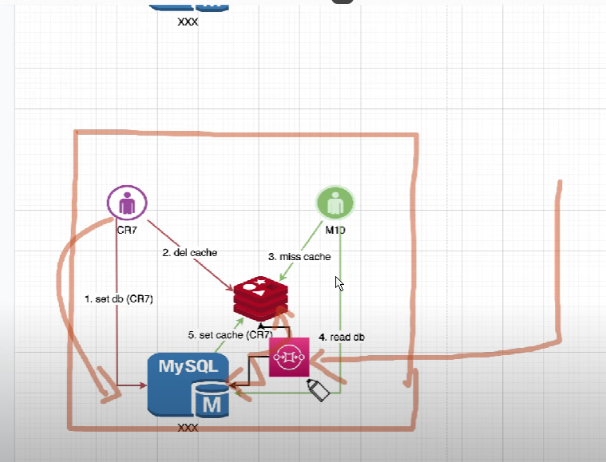

```sql
show databases;

create database sbtest;

create user sbtest_user identified by "password";

grant all on sbtest.* to 'sbtest_user'@'%';

show grants for sbtest_user

use sbtest
```

- After that,

```sql
ifconfig

-- en0: take IP address: inet: 192.168.xx.xxx

-- create mock database : 16 tables and 10000 records each
sysbench --db-driver=mysql --mysql-user=sbtest_usersys --mysql_password=password --mysql-db=sbtest  --mysql-host=192.168.xx.xxx --mysql-port=3306 --tables=16 --table-size=10000 oltp_read_write prepare


- command run
$ sysbench --db-driver=mysql --mysql-user=user --mysql_password=password --mysql-db=myqb --mysql-host=192.168.43.163 --mysql-port=3306 --tables=16 --table-size=10000 --threads=4 --time=200 --events=0 --report-interval=1 usr/bin/oltp_read_write run
```
 


